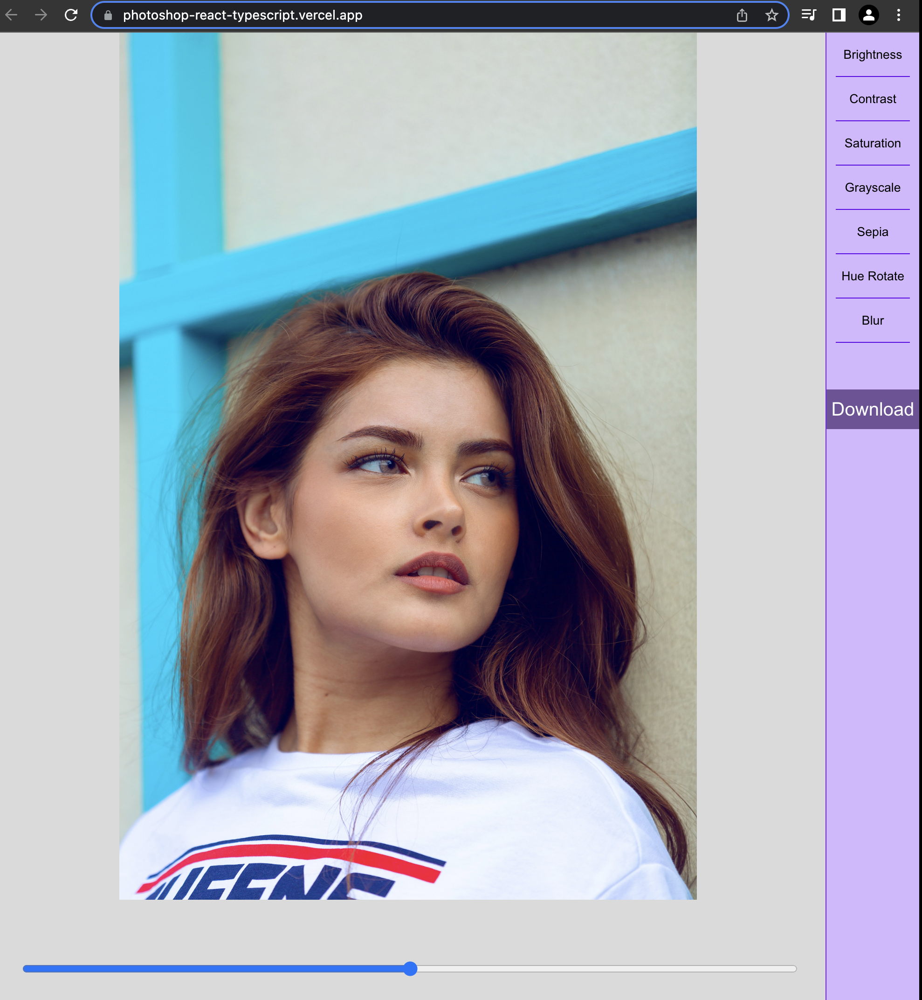

# A Photoshop React with Typescript Project

## PhotoEdit

[Live Url https://photoshop-react-typescript.vercel.app/](https://photoshop-react-typescript.vercel.app/)



## Deploy your own

[](https://github.com/anjola-adeuyi/photoshop-react-typescript)

## How to use

```bash
yarn
# then
yarn dev
```
